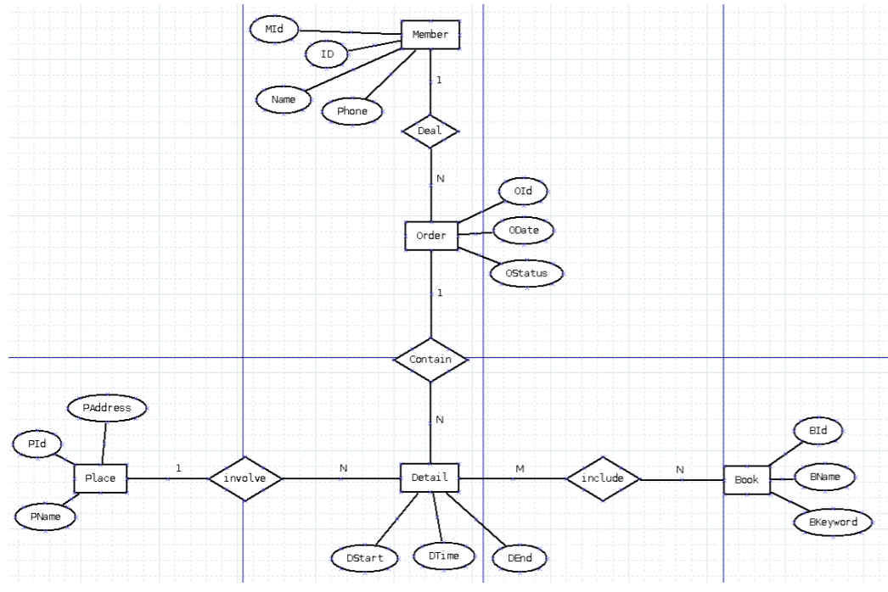
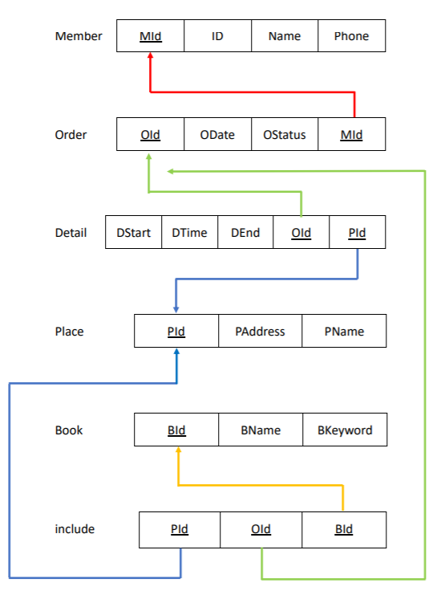

# 107-1-databases

## 組員:
### 205417065 林菁雯
### 406418177 林珈宇

#### 圖書館製作一個網路會員書籍借閱系統，會員可在網路上借閱書籍。此一系統的資料需求如下：
1. 會員 (Member)：會員編號 (MId)、身分證 (ID)、姓名 (Name)、電話 (Phone)，會員編號唯一。
2. 訂單 (Order)：訂單編號 (OId)、訂單日期 (Odate)、訂單狀態 (OStatus)，訂單編號唯一。
3. 訂單明細 (Detail)：借閱日期 (DStart)、借閱天數 (DTime)、歸還日期 (DEnd)。
4. 書籍 (Book)：書籍編號 (BId)、書名 (BName)、關鍵字(BKeyword)，書籍編號唯一。
5. 取書地點 (Place)：圖書館編號 (PId) 、地址 (PAddress) 、名稱 (PName)，圖書館編號唯一。

### ER Model

### Relational Model
